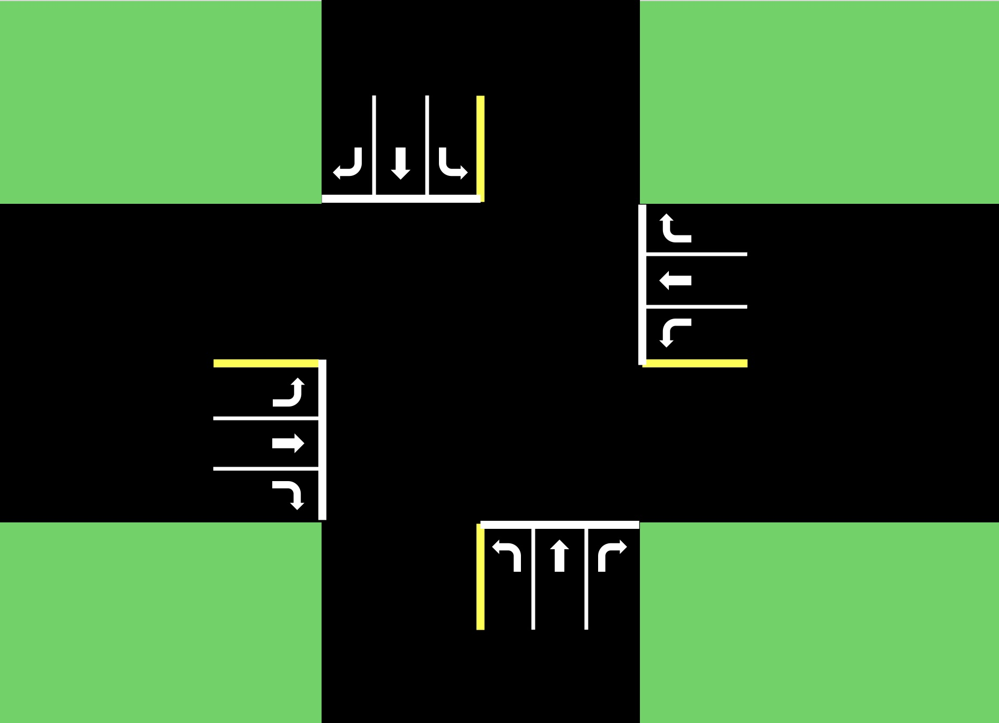

# MDP-based Traffic Simulation

Final project for **Decision Making Under Uncertainty (Spring 2025)** at CU Boulder. This project explores strategies for optimizing traffic light control using decision-theoretic methods. It consists of three main components:

1. A **Markov Decision Process (MDP)** model implemented in Julia.
2. A custom **traffic simulation and visualization** environment in Python.
3. A **neural network-based controller** trained to manage traffic signals safely and efficiently.

---

### Setup Instructions (Python)

These instructions are for the Python-based traffic simulation and neural network controller.

### Prerequisites

- Python 3.8 or later
- [pip](https://pip.pypa.io/en/stable/installation/)

### Install dependencies

```bash
pip install -r requirements.txt
```

### Run the simulation
```bash
python main.py
```
## Python Simulation Features:  
Simulates a five-lane intersection with realistic directional control based on the state definition. Vehicles follow configurable spawn patterns (e.g., random or rush-hour traffic).
Built-in visualization using matplotlib shows cars, lights, and queues. Collision detection is included and penalized in the reward function.

The neural network controller uses a feedforward architecture (via PyTorch) and takes as input the current state of the intersection. It outputs an action to either keep or switch the light configuration. It is trained to maximize a composite reward function that balances safety and efficiency.

## The State Space
The state space is represented as a 12-element vector indicating the number of cars in each lane, and is based off the diagram below. 



This also includes the direction of travel for each lane, like if a car is turning left or going straight. 

## The Action Space

The action space consists of the four traffic light signals for going straight or turning left for each of the directions.

## Reward Function
The neural network uses the following reward function

  reward = collision_penalty + throughput_bonus + duration_reward + imbalance_penalty

where: 
- collision_penalty : Large negative reward for each crash
- throughput_bonus: Positive reward per vehicle that exits
- duration_reward Rewards keeping a green light active for a reasonable amount of time
- imbalance_penalty: Penalizes starving any direction of traffic

Each component is weighted and can be adjusted for safety or efficiency priorities.